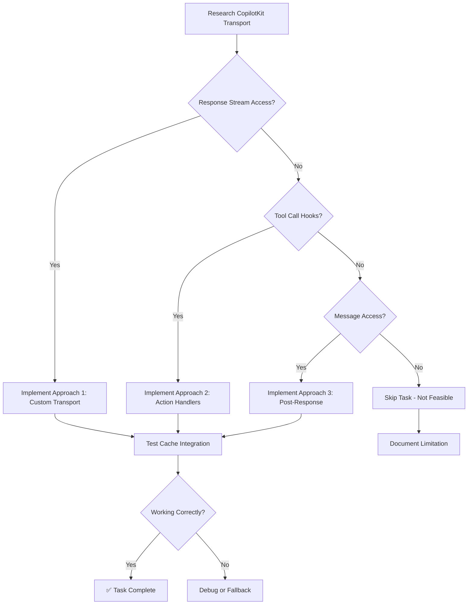

# Task 7: MCP Cache Integration (Optional)

**Goal**: Write MCP query results to Apollo cache for optimized data fetching.

**Status**: 🟡 Optional / Research Required

**Dependencies**: Task 2 (Supergraph MCP), Task 3 (Fragment Embeds)

**Estimated Effort**: 4-6 hours (if feasible)

---

## 📋 Overview

This optional task attempts to replicate Vercel SDK's custom transport behavior: intercepting MCP tool responses and writing GraphQL results to Apollo cache. This eliminates duplicate network requests when users navigate to screens that query the same data the agent already fetched.

**⚠️ Warning**: This may not be possible with CopilotKit's default transport layer. Proceed only if CopilotKit exposes response stream hooks or middleware.

---

## 🎯 Success Criteria (If Feasible)

- ✅ MCP tool calls tracked client-side
- ✅ GraphQL responses extracted from tool outputs
- ✅ Data written to Apollo cache with correct query/variables
- ✅ Subsequent screen visits use cached data (no duplicate requests)
- ✅ Cache writes don't interfere with normal operation

**OR** (If Not Feasible):

- ✅ Research documented showing CopilotKit limitations
- ✅ Alternative approaches explored
- ✅ Recommendation provided (skip or use workaround)

---

## 📁 Files to Create/Modify

### New Files (If Feasible)

- `expo/src/agent/copilotkit/CopilotKitCacheTransport.ts` - Custom transport with cache integration

### Modified Files (If Feasible)

- [`expo/src/agent/copilotkit/Omnibar.tsx`](../Omnibar.tsx) - Use custom transport

---

## 🔍 Research Phase

### Step 1: Investigate CopilotKit Transport System

**Questions to Answer**:

1. **Does CopilotKit expose response streams?**
   - Check: `useCopilotChat` hook options
   - Check: `CopilotRuntime` middleware hooks
   - Check: Custom transport options in docs

2. **Can we intercept tool responses?**
   - Check: `onToolCall` callback in `useCopilotChat`
   - Check: Tool execution hooks
   - Check: Message transformation options

3. **What's the message structure?**
   - Inspect: Tool call messages
   - Inspect: Tool response messages
   - Inspect: Where `structuredContent` lives

**Documentation to Review**:

- [CopilotKit Transport API](https://docs.copilotkit.ai/reference/transport)
- [useCopilotChat Options](https://docs.copilotkit.ai/reference/hooks/useCopilotChat)
- [Message Format](https://docs.copilotkit.ai/guides/message-format)

---

### Step 2: Compare with Vercel SDK Implementation

**Vercel SDK's Approach** ([`GraphQLToolChatTransport.ts`](../../vercelSdk/Omnibar/GraphQLToolChatTransport.ts)):

```typescript
export class GraphQLToolChatTransport extends DefaultChatTransport<UIMessage> {
  override processResponseStream(
    stream: ReadableStream<Uint8Array<ArrayBufferLike>>
  ): ReadableStream<UIMessageChunk> {
    const toolCalls: Record<string, { name: string; variables?: any }> = {};
    const { client } = this;

    return super.processResponseStream(stream).pipeThrough(
      new TransformStream({
        transform(chunk, controller) {
          controller.enqueue(chunk);

          switch (chunk.type) {
            case "tool-input-start":
              toolCalls[chunk.toolCallId] = { name: chunk.toolName };
              break;

            case "tool-input-available":
              toolCalls[chunk.toolCallId].variables = chunk.input;
              break;

            case "tool-output-available":
              const tool = toolCalls[chunk.toolCallId];
              const queryDetails = KnownQueries[tool.name.toLowerCase()];
              const data = chunk.output.structuredContent?.data;

              if (queryDetails && data) {
                client.writeQuery({
                  query: queryDetails.query,
                  data,
                  variables: tool.variables,
                });
              }
              break;
          }
        },
      })
    );
  }
}
```

**Key Features**:

- Intercepts response stream
- Tracks tool calls by ID
- Extracts `structuredContent.data` from MCP responses
- Maps tool names to GraphQL queries
- Writes to Apollo cache with `client.writeQuery()`

**Can This Be Replicated in CopilotKit?**

- Requires: Response stream access
- Requires: Tool call/response tracking
- Requires: Structured content extraction

---

## 🏗️ Implementation Steps (If Feasible)

### Approach 1: Custom Transport (If CopilotKit Supports)

**File**: `expo/src/agent/copilotkit/CopilotKitCacheTransport.ts` (new file)

```typescript
import { ApolloClient } from "@apollo/client";
import * as KNOWN from "@/agent/mcp/supergraph-mcp-operations";
import { print } from "graphql";

const KnownQueries: Record<string, { query: any; defaultVariables?: any }> =
  Object.fromEntries(
    Object.entries(KNOWN).map(([key, value]) => [
      key.toLowerCase(),
      { query: value },
    ])
  );

KnownQueries["getcurrentevent"] = {
  query: KNOWN.GetEvents,
  defaultVariables: { ids: [process.env.EXPO_PUBLIC_CURRENT_EVENT] },
};

export class CopilotKitCacheTransport {
  private client: ApolloClient;
  private toolCalls: Record<string, { name: string; variables?: any }> = {};

  constructor(client: ApolloClient) {
    this.client = client;
  }

  // This method would need to be called by CopilotKit's transport system
  handleToolCall(toolCallId: string, toolName: string, variables: any) {
    this.toolCalls[toolCallId] = { name: toolName, variables };
  }

  handleToolResponse(toolCallId: string, output: any) {
    const tool = this.toolCalls[toolCallId];
    if (!tool) return;

    const queryDetails = KnownQueries[tool.name.toLowerCase()];
    const data = output.structuredContent?.data;

    if (queryDetails && data) {
      console.log("Writing MCP result to Apollo cache:", {
        query: print(queryDetails.query),
        variables: { ...queryDetails.defaultVariables, ...tool.variables },
      });

      this.client.writeQuery({
        query: queryDetails.query,
        data,
        variables: { ...queryDetails.defaultVariables, ...tool.variables },
      });
    }

    // Cleanup
    delete this.toolCalls[toolCallId];
  }
}
```

**Usage in Omnibar** (hypothetical):

```typescript
const cacheTransport = useRef(new CopilotKitCacheTransport(client));

const { messages, sendMessage, isLoading } = useCopilotChat({
  // ... other options ...

  // If CopilotKit supports onToolCall
  onToolCall: (toolCall) => {
    cacheTransport.current.handleToolCall(
      toolCall.id,
      toolCall.name,
      toolCall.arguments
    );
  },

  // If CopilotKit supports onToolResponse
  onToolResponse: (toolCallId, output) => {
    cacheTransport.current.handleToolResponse(toolCallId, output);
  },
});
```

---

### Approach 2: useCopilotAction Handler (Client-Side Interception)

If custom transport isn't possible, intercept in action handlers:

```typescript
// In Omnibar.tsx or separate file
function useMCPCacheIntegration() {
  const client = useApolloClient();

  useCopilotAction({
    name: "GetEvents",
    // This would override the server-side MCP action
    handler: async (args) => {
      // Call the actual MCP tool (through server)
      const response = await fetch("/api/copilotkit/mcp/GetEvents", {
        method: "POST",
        body: JSON.stringify(args),
      });
      const data = await response.json();

      // Write to cache
      client.writeQuery({
        query: KNOWN.GetEvents,
        data: data.structuredContent?.data,
        variables: args,
      });

      return data;
    },
  });

  // Repeat for GetSessions, GetEntities, etc.
}
```

**Drawbacks**:

- Requires overriding each MCP action
- Server-side MCP tools wouldn't be used directly
- More maintenance overhead

---

### Approach 3: Post-Response Cache Population

If real-time interception isn't possible, populate cache after agent responds:

```typescript
// In Omnibar.tsx
const { messages } = useCopilotChat({
  /* ... */
});

useEffect(() => {
  // After agent responds, check if any tool calls happened
  const lastMessage = messages[messages.length - 1];
  if (lastMessage?.role === "assistant") {
    // Parse message for tool results
    // Extract GraphQL data
    // Write to cache
    // This is less ideal but better than nothing
  }
}, [messages]);
```

**Drawbacks**:

- Not real-time
- Harder to extract structured data
- May miss some updates

---

## 🧪 Testing Steps (If Implemented)

### 1. Enable Cache Logging

```typescript
// In apollo/client.ts
const cache = new InMemoryCache({
  // ... existing config ...
});

// Monkey-patch to log writes
const originalWriteQuery = cache.writeQuery.bind(cache);
cache.writeQuery = (options) => {
  console.log("📝 Cache write:", options);
  return originalWriteQuery(options);
};
```

### 2. Test Cache Population

**Step 1: Query via Agent**

```
User: "Show me today's sessions"
Expected:
- Agent calls GetSessions MCP tool
- Console logs: "📝 Cache write: GetSessions"
- Data written to cache
```

**Step 2: Navigate to Schedule Screen**

```
User: (navigates to schedule)
Expected:
- Screen reads from cache
- No duplicate network request
- Apollo DevTools shows cache hit
```

### 3. Verify Cache Correctness

**Open Apollo Client DevTools**:

1. Check cache entries after MCP query
2. Verify query variables match
3. Verify data structure is correct
4. Navigate to screen and check cache hit

### 4. Test Multiple Queries

```
User: "What events are there?"
User: "Show me speakers"
User: "Find nearby coffee shops"

Expected:
- All 3 MCP results cached
- Cache has GetEvents, GetSpeakers, GetNearbyPlaces entries
- No overwrites or conflicts
```

---

## 🔍 Decision Tree



---

## 📚 Research Findings Template

Fill this out after research phase:

### CopilotKit Transport Capabilities

**Response Stream Access**: ☐ Yes / ☐ No  
**Details**: _[How to access, if available]_

**Tool Call Hooks**: ☐ Yes / ☐ No  
**Available Hooks**: _[List hooks like onToolCall, onToolResponse]_

**Message Transformation**: ☐ Yes / ☐ No  
**Options**: _[Middleware, interceptors, etc.]_

### Recommendation

☐ **Proceed with Approach 1** (Custom Transport)  
☐ **Proceed with Approach 2** (Action Handlers)  
☐ **Proceed with Approach 3** (Post-Response)  
☐ **Skip Task** (Not feasible with CopilotKit)

**Justification**: _[Explain reasoning]_

---

## 🔍 Troubleshooting (If Implemented)

### Issue: "Cache writes not happening"

**Debug checklist**:

```typescript
// 1. Verify tool call tracking
console.log("Tool calls:", toolCalls);

// 2. Verify output structure
console.log("Tool output:", output);
console.log("Structured content:", output.structuredContent);

// 3. Verify query mapping
console.log("Query details:", KnownQueries[toolName.toLowerCase()]);

// 4. Test cache write directly
client.writeQuery({
  query: KNOWN.GetEvents,
  data: testData,
  variables: { ids: ["test"] },
});
```

### Issue: "Cache overwrites existing data"

**Solution**: Use `merge` policy in cache config:

```typescript
const cache = new InMemoryCache({
  typePolicies: {
    Query: {
      fields: {
        events: {
          merge(existing, incoming) {
            // Merge arrays intelligently
            return incoming;
          },
        },
      },
    },
  },
});
```

### Issue: "Variables don't match"

**Cause**: MCP tool variables differ from screen query variables

**Solution**: Map variables correctly:

```typescript
// MCP might use { ids: ["123"] }
// But screen query uses { eventId: "123" }

const variableMapping = {
  GetEvents: (mcpVars) => ({
    eventId: mcpVars.ids?.[0],
  }),
};

const mappedVars = variableMapping[toolName]?.(tool.variables) || tool.variables;
client.writeQuery({ variables: mappedVars, ... });
```

---

## 📚 Reference Links

### CopilotKit Documentation

- [Transport API](https://docs.copilotkit.ai/reference/transport)
- [Custom Transport](https://docs.copilotkit.ai/guides/custom-transport)
- [Message Hooks](https://docs.copilotkit.ai/reference/hooks/message-hooks)

### Apollo Client

- [writeQuery](https://www.apollographql.com/docs/react/caching/cache-interaction/#writequery)
- [Cache Policies](https://www.apollographql.com/docs/react/caching/cache-configuration/)

### Vercel SDK Comparison

- [`expo/src/agent/vercelSdk/Omnibar/GraphQLToolChatTransport.ts`](../../vercelSdk/Omnibar/GraphQLToolChatTransport.ts) - Original implementation

---

## ✅ Completion Checklist

### Research Phase

- [ ] CopilotKit transport system investigated
- [ ] Response stream access checked
- [ ] Tool call hooks documented
- [ ] Decision made (proceed or skip)
- [ ] Research findings documented

### Implementation Phase (If Feasible)

- [ ] Custom transport or alternative implemented
- [ ] MCP tool call tracking working
- [ ] Cache writes happening
- [ ] Variables mapped correctly
- [ ] Testing completed:
  - [ ] Cache populated from MCP queries
  - [ ] Screen navigation uses cached data
  - [ ] No duplicate requests
  - [ ] Apollo DevTools shows cache hits
- [ ] No cache conflicts or overwrites
- [ ] No console errors

### Documentation Phase (If Not Feasible)

- [ ] Limitation documented
- [ ] Workarounds explored
- [ ] Recommendation provided
- [ ] Impact on app performance noted

---

## 🚀 Outcome

### If Successful:

- ✅ MCP query results cached
- ✅ Reduced network requests
- ✅ Faster screen loads
- ✅ Better offline support

### If Not Feasible:

- ✅ Limitation understood
- ✅ App still functions correctly
- ✅ Alternative optimizations considered (e.g., prefetching, longer cache TTL)

---

## 💡 Alternative Optimizations (If Task Skipped)

If cache integration isn't possible, consider these alternatives:

1. **Prefetching**: Prefetch route data when agent mentions navigation
2. **Longer Cache TTL**: Increase Apollo cache retention time
3. **Local State**: Use React state to share data between agent and screens
4. **Event Emitters**: Emit events when agent fetches data, screens listen
5. **Context Provider**: Share fetched data via React Context

---

**Last Updated**: 2025-10-21

**Status**: Awaiting research phase
